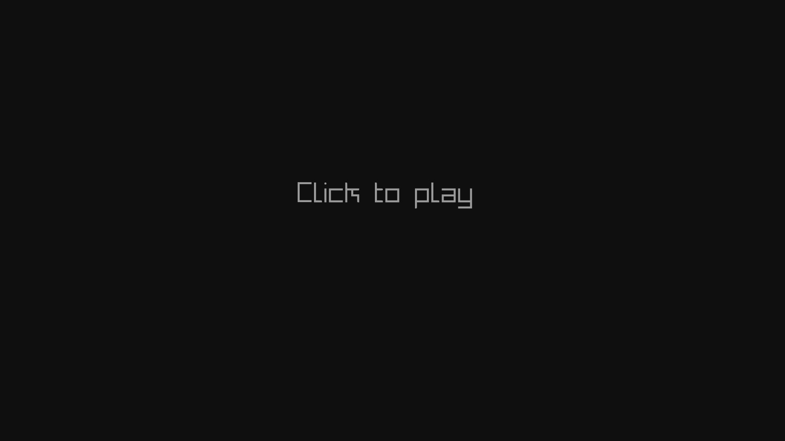
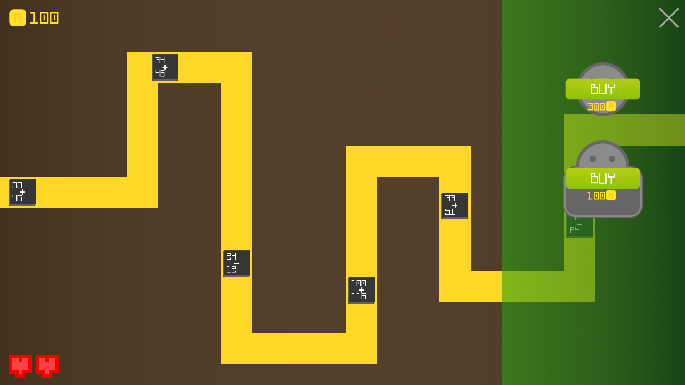
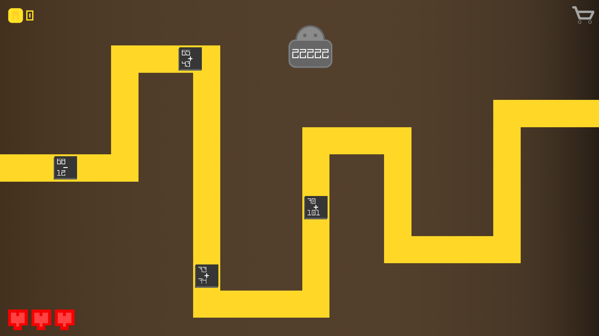
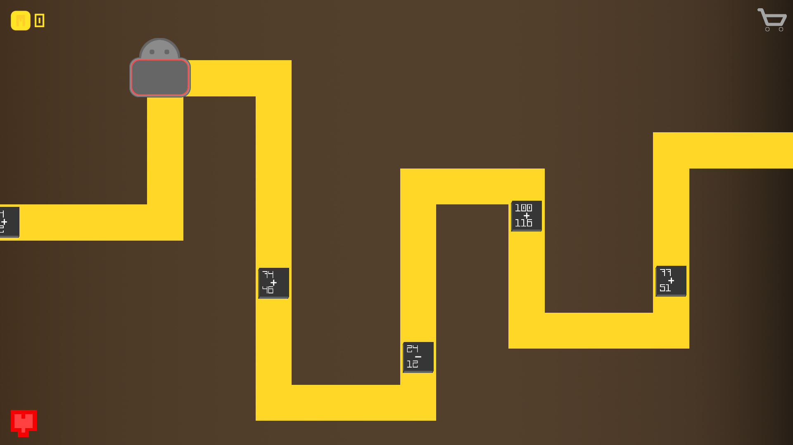

  

    
    <h1 style="margin: 1rem">Mactangle</h1>
    
  

There you will have to defend the END OF PATH from deadly squares that have mathematicals operations on them.

## Version
1.1.1

## Table of contents
- [Version](#version)
- [Table of contents](#table-of-contents)
- [General info](#general-info)
- [Screenshots](#screenshots)
- [Libs](#libs)
- [License](#license)

## General info
From start of path get out squares that if they reach end of path take you a heart (default you have three ones). To destroy them you can use two stuffs. First (bedler) you can place everywhere and if you write to it value that equal with mathematical operation on whichever mactangle is, you will destroy it. Second one costs (default) 300 MCoins and them you can place only on path and when any of squares will get on it, one will be destroyed.   

## Screenshots

## Libs
Project is created with:
* [SFML](https://github.com/SFML/SFML)
	
## License
[Mozilla Public License](LICENSE.md)